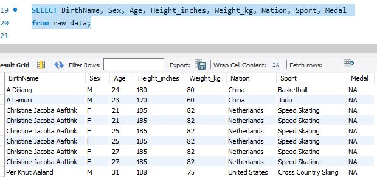

# Index
Home page [here](https://github.com/JAMPS657/Personal_Projects)

Project Selection [here](https://github.com/JAMPS657/Personal_Projects/tree/main/Personal%20Programming%20Projects)

# Summary
In this demonstration, I create, populate, and query a database. Specifically, I am using data from my [Exploration of Olympics Data](https://github.com/JAMPS657/Personal_Projects/tree/main/Personal%20Programming%20Projects/Analysis%20of%20Olympics%20Data) project.

## Creating a Database
Using the "CREATE" statement, I create a database called "olympics".

## Creating A Table
Using the "CREATE" statement, I create a table within the "olympics" database and label it "raw_data". This allows us to populate the database with data.

## Database Query
Now, with the relevant data uploaded; I use the "SELECT" statement to look at specific portions/columns of the data set. 

The first query is data relevant to the individual athlete. This would be important in identifying relevant stats to the athlete in question (e.g. Weight, Height, etc.)

The second query is specific to Sex, Age, and year in attendance to the Olympics. This allows us to look at the relationship between timelines of Female and Male attendance to the olympics. My intuition being that there is a higher percentage of male participants before a particular year (e.g. women's rights revolution).

The third query is specific to Season, City, and Sport. This allows us to look at the relationship between what cities typically host the Winter or Summer Olympics. Additionally a relationship to what sports are hosted during which season.

